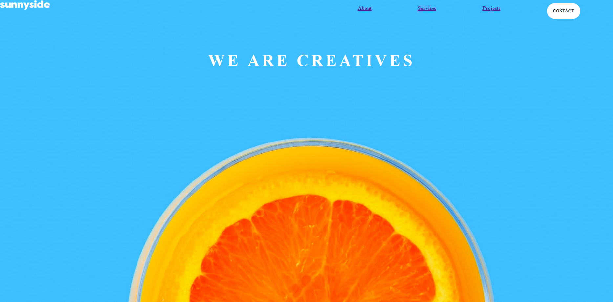
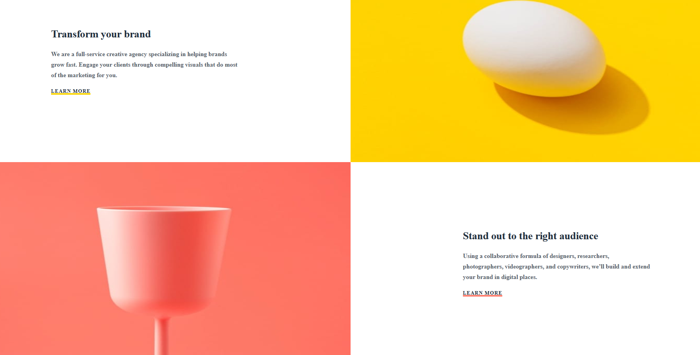
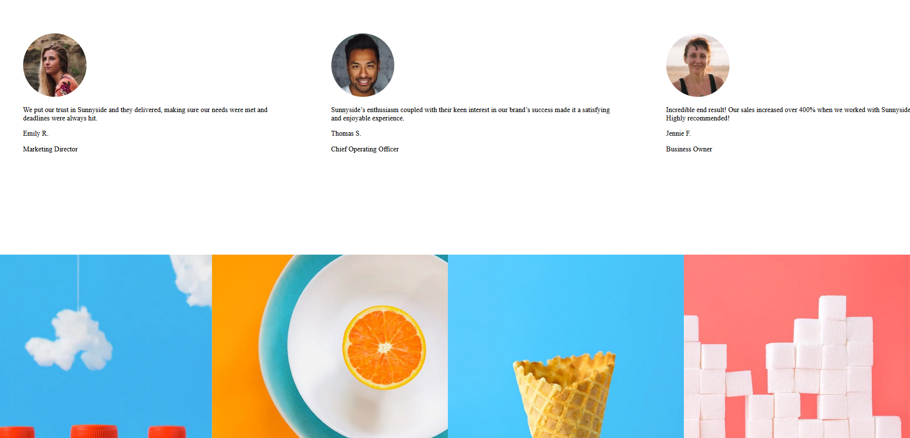

# sunnyside-agency

Ce projet consiste à copier les exigences d'une maquette (Figma) donnée dans le cadre d'un exercice d'intégration web. L'objectif est de reproduire fidèlement l'apparence visuelle et le design de la maquette en utilisant des technologies telles que HTML, CSS, SASS.

### Sommaire

1. [Description du Projet](#description)
2. [Captures d'écran](#captures-décran)
3. [Installation](#installation)
4. [Ressources Utilisées](#langages)

## 📌 Détails du Projet

### Description

Ce repository contient les fichiers nécessaires à la reproduction de la maquette fournie dans Figma. Les exigences comprennent la disposition des éléments, les couleurs, les polices, les dimensions, ainsi que tout autre détail visuel présent dans la maquette.

https://dams4953.github.io/sunnyside-agency/

### Captures d'Écran

## 📌 Installation

### Installation
1. Clonez le repo.
2. Accédez au répertoire du projet.
3. Assurez-vous d'avoir npm installés sur votre machine.
4. Assurez-vous d'avoir Sass installé. (npm install sass --save-dev).
5. L'application sera disponible sur votre localhost.

## 📌 Ressources Utilisées

### Langages

### Tools

[Figma](https://www.figma.com/)

